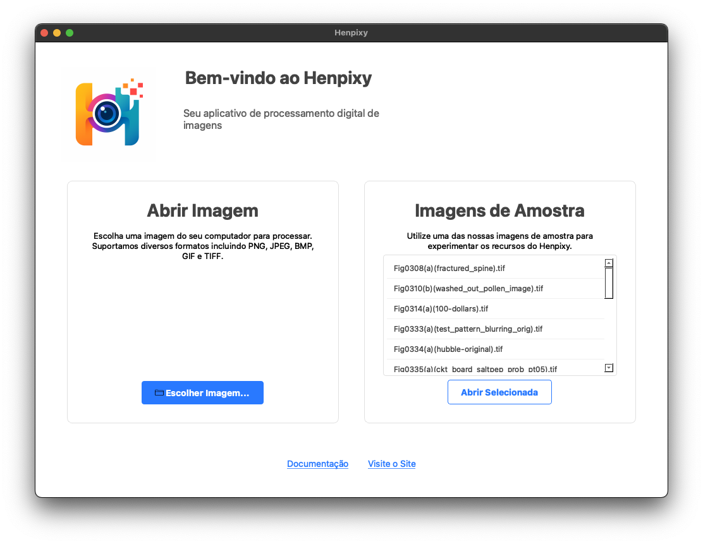

<h1 align="center">
  <br>
  <a href="https://henpixy.lailsonhenrique.com/"></a>
  <br>
  Henpixy
  <br>
</h1>

<h4 align="center">Um aplicativo de processamento digital de imagens desenvolvido em Python com <a href="https://wiki.qt.io/Qt_for_Python" target="_blank">PySide6</a>.</h4>

<p align="center">
  <a href="https://github.com/lailson/Henpixy/releases/tag/0.1.25">
    
  </a>
  <a href="https://github.com/lailson/Henpixy/releases/download/0.1.25/Henpixy-0.1.25.dmg">
    
  </a>
  <a href="https://github.com/lailson/Henpixy/blob/main/LICENSE">
      
  </a>
  <a href="https://www.python.org/">
    
  </a>
</p>

<p align="center">
  <a href="#principais-funcionalidades">Principais Funcionalidades</a> •
  <a href="#como-usar">Como Usar</a> •
  <a href="#download">Download</a> •
  <a href="#desenvolvimento">Desenvolvimento</a> •
  <a href="#tecnologias">Tecnologias</a> •
  <a href="#licença">Licença</a>
</p>



## Principais Funcionalidades

* Interface Moderna e Intuitiva
  - Tela de boas-vindas com acesso rápido às funcionalidades
  - Menu organizado para fácil navegação entre ferramentas
* Suporte a Diversos Formatos de Imagem
  - PNG, JPEG, BMP, GIF, TIFF, WebP, ICO, PSD, XBM, XPM
* Operações de Processamento de Imagem
  - Transformações básicas: negativo, gama, alargamento de contraste
  - Filtros espaciais: média, mediana, mínimo, máximo, Laplaciano
  - Fatiamento por planos de bits com visualização detalhada
  - Pseudocores com mapas predefinidos e personalizáveis
* Análise de Imagem
  - Visualização de histogramas com estatísticas detalhadas
  - Equalização de histograma com comparação antes/depois
  - Inspeção de pixels com matriz interativa
  - Exibição de metadados EXIF
* Sistema de Histórico
  - Navegação completa entre estados da imagem
  - Reversão das operações aplicadas
* Ferramentas de Visualização
  - Zoom avançado com atalhos de teclado
  - Comparação de imagens lado a lado
* Tema claro moderno e consistente
  - Visual agradável em todos os sistemas operacionais

## Como Usar

Para clonar e executar este aplicativo, você precisará de [Git](https://git-scm.com), [Python 3.12](https://www.python.org/) e opcionalmente [Conda](https://conda.io/). Da sua linha de comando:

```bash
# Clone este repositório
$ git clone https://github.com/lailson/Henpixy.git

# Entre no repositório
$ cd Henpixy

# Crie um ambiente virtual (opcional, mas recomendado)
$ conda create --prefix ./env python=3.12
$ conda activate ./env

# Instale as dependências
$ pip install -e .

# Execute o aplicativo
$ python -m henpixy.main
```

> **Nota**
> O aplicativo foi testado principalmente no macOS, mas deve funcionar em qualquer plataforma que suporte Python e Qt.

## Download

Você pode [baixar](https://github.com/lailson/Henpixy/releases/tag/0.1.25) a versão mais recente do Henpixy para macOS.

- [Henpixy-0.1.25.dmg](https://github.com/lailson/Henpixy/releases/download/0.1.25/Henpixy-0.1.25.dmg) - Para macOS

### Instruções para macOS

Se ao tentar abrir o aplicativo aparecer a mensagem **"Henpixy.app está danificado e não pode ser aberto"**, siga um dos métodos abaixo:

#### Método 1 (Recomendado):
1. Clique com o botão direito (ou Control+clique) no aplicativo `Henpixy.app`
2. Selecione "Abrir" no menu de contexto
3. Na janela de aviso, clique em "Abrir" novamente
4. O aplicativo será executado normalmente e nas próximas vezes poderá ser aberto com duplo clique

#### Método 2 (Via Terminal):
1. Abra o Terminal (em Aplicativos > Utilitários)
2. Digite o comando abaixo (substitua pelo caminho correto se necessário):
   ```bash
   xattr -d com.apple.quarantine /Applications/Henpixy.app
   ```
3. Agora o aplicativo deve abrir normalmente

> **Nota**
> Essas restrições de segurança são impostas pelo macOS para proteger contra software não assinado.
> O Henpixy é um aplicativo seguro, desenvolvido para fins educacionais.

## Desenvolvimento

### Operações Implementadas

- ✅ Filtro de Intensidade zero
- ✅ Função negativo (transformação S = L - 1 - r)
- ✅ Transformação gama (potência) ajustável
- ✅ Alargamento de contraste com pontos configuráveis
- ✅ Fatiamento por planos de bits
- ✅ Equalização de histograma
- ✅ Pseudocores por fatiamento de intensidades
- ✅ Filtro de suavização da média
- ✅ Filtros estatísticos (média, mediana, mínimo, máximo)
- ✅ Filtro Laplaciano e aguçamento de imagens

### Ferramentas de Visualização

- ✅ Histogramas interativos
- ✅ Estatísticas detalhadas da imagem
- ✅ Visualização de intensidade de pixels
- ✅ Comparação antes/depois para transformações
- ✅ Navegação por histórico de alterações
- ✅ Visualização de metadados EXIF quando disponíveis

## Tecnologias

Este software utiliza os seguintes pacotes de código aberto:

- [Python](https://www.python.org/) - Linguagem de programação
- [PySide6 (Qt6)](https://wiki.qt.io/Qt_for_Python) - Framework para interface gráfica
- [Pillow (PIL Fork)](https://python-pillow.org/) - Biblioteca de processamento de imagens
- [NumPy](https://numpy.org/) - Computação numérica eficiente
- [Matplotlib](https://matplotlib.org/) - Visualização de dados e histogramas

## Licença

MIT

---

> [Site do Projeto](https://henpixy.lailsonhenrique.com/) &nbsp;&middot;&nbsp;
> GitHub [@lailson](https://github.com/lailson) &nbsp;&middot;&nbsp;
> Desenvolvido para fins educacionais como parte de trabalho acadêmico
